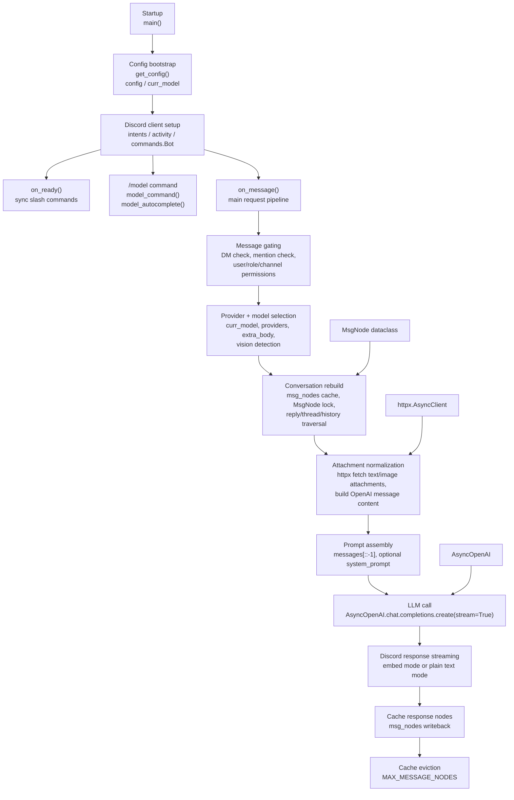
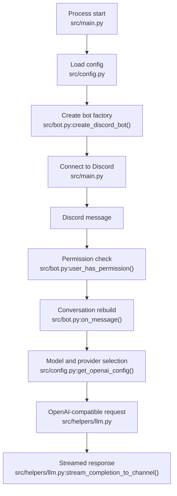

# ARCHITECTURE

## Overview

The current project is a single-process Discord bot built around `discord.py`, `httpx`, `openai`, and a YAML config file.

The target architecture should keep the same lightweight deployment style, but split responsibilities into clear layers so the bot can grow into a study assistant.

## Code navigation map

Use this diagram as the fastest way to find runtime behavior in the current codebase. The implementation is now modular under `src/`.



## File guide

- `src/main.py:13-29` defines the async entrypoint.
- `src/config.py:6-9` loads YAML with `get_config()`.
- `src/config.py:12-16` extracts Discord bot token.
- `src/config.py:19-40` handles OpenAI client instantiation and request config merging.
- `src/prompts/abnt.py` defines ABNT prompts, loads `abnt_reference.md`, and builds `build_abnt_messages()`.
- `src/helpers/llm.py:8-55` streams LLM responses to Discord and formats provider errors.
- `src/bot.py:25-27` defines `MsgNode`, the cache structure for conversation reconstruction.
- `src/bot.py:67-113` defines `user_has_permission()` and attachment/document parsing helpers.
- `src/bot.py:219-985` contains `create_discord_bot()` factory which registers all event handlers and slash commands.
- `main.py` is the thin wrapper that calls `src.main.run()`.
- `tests/` contains pytest unit tests for prompts, config, and bot utility functions.

## Current architecture

### Runtime flow



### Current building blocks

- **Entry point**: `src/main.py` handles startup and async runtime.
- **Config layer**: `src/config.py` loads and manages YAML configuration.
- **Discord layer**: `src/bot.py` handles events, slash commands, and replies via `create_discord_bot()` factory.
- **Prompts layer**: `src/prompts/abnt.py` contains ABNT-specific prompt construction and ABNT markdown reference loading.
- **LLM layer**: `src/helpers/llm.py` abstracts streaming responses and provider error handling.
- **Context layer**: message history is reconstructed in `src/bot.py:on_message()` from replies, threads, and nearby messages.
- **Attachment layer**: text and image attachments are fetched with `httpx` (in `src/bot.py`).
- **Cache layer**: `msg_nodes` stores message state in memory (managed in `src/bot.py`).
- **Tests**: `tests/` contains pytest unit tests for pure logic.

### Current strengths

- Simple modular structure without over-engineering.
- Easy provider swapping.
- Hot-reloadable config.
- Testable pure functions extracted.
- Good foundation for a private server.

## Target architecture

### Layers

```text
Discord UI
  -> Command / mode router
  -> Task handlers
  -> Shared services
  -> Storage / search / model providers
  -> Discord response formatter
```

### 1. Discord UI layer

Responsible for:

- slash commands,
- mentions and replies,
- permission checks,
- message formatting,
- progress feedback.

### 2. Router layer

Responsible for:

- identifying the requested mode,
- validating inputs,
- choosing the right handler,
- applying defaults and guardrails.

### 3. Task handlers

Each feature area should become a separate handler:

- **ResearchHandler**: web search, source ranking, ABNT report generation.
- **CodeHandler**: code generation with line-by-line explanations.
- **StudyPlanHandler**: calendar-aware plan construction.
- **ABNTHelper**: references, citations, and structure checks.
- **QuizHandler**: question generation and correction.
- **MonitorHandler**: progress tracking and summaries.
- **KnowledgeHandler**: summaries and search over shared server content.

### 4. Shared services

Reusable services should sit below the handlers:

- **ConfigService**: loads YAML and merges defaults.
- **PermissionService**: user, role, and channel access rules.
- **ModelService**: provider/model selection and request building.
- **SearchService**: external web search and result normalization.
- **CitationService**: ABNT formatting.
- **StudyService**: timetable and plan generation.
- **KnowledgeService**: ingestion and search of server material.
- **ResponseService**: Discord-friendly rendering, including file attachments for long outputs.

### 5. Storage layer

The first stable storage choice should stay lightweight.

**Good candidates**
- in-memory cache for conversation state,
- local files for lightweight artifacts,
- SQLite for persistent study progress, quizzes, references, and server notes.

**What belongs here**
- study plans,
- progress records,
- question banks,
- source indexes,
- curated notes,
- generated references.

### 6. Model/providers layer

Keep the current OpenAI-compatible abstraction.

**Supports**
- OpenAI,
- OpenRouter,
- Groq,
- Mistral,
- xAI,
- Google,
- local servers like Ollama, LM Studio, and vLLM.

### 7. External data layer

This is where the study features become useful.

**Sources**
- web search engines or search APIs,
- official documentation,
- public legal sources,
- PDFs and notes shared in the server,
- user-generated summaries and references.

## Data flows by mode

### Research mode

```text
Request
  -> search
  -> source ranking
  -> evidence extraction
  -> report generation
  -> citation formatting
```

### Code mode

```text
Request
  -> language selection
  -> snippet generation
  -> line/block explanations
  -> reference links
```

### Study-plan mode

```text
Topics + exam date + free time
  -> workload estimation
  -> schedule assembly
  -> review/practice insertion
  -> plan output
```

### ABNT helper

```text
Source material
  -> metadata extraction
  -> citation/reference formatting
  -> validation hints
```

### Quiz/simulado

```text
Topics + difficulty + question count
  -> question generation
  -> answer evaluation
  -> explanation output
```

### Monitoria

```text
User activity + study events
  -> progress aggregation
  -> weak-topic detection
  -> summary report
```

## Recommended module boundaries

The current modular structure is:

- `src/main.py`: process entry and async bootstrap.
- `src/config.py`: configuration and provider setup.
- `src/prompts/abnt.py`: prompt templates/builders and ABNT reference loading.
- `src/helpers/llm.py`: LLM communication and streaming.
- `src/bot.py`: Discord events, commands, and bot factory.
- `tests/`: pytest unit tests.

For future expansion beyond these modules:

- `handlers/` for feature-specific handlers (research, code, ABNT, quiz, etc.).
- `services/` for shared utilities (search, citations, progress tracking).
- `storage/` for persistence (study plans, progress, references).
- `formatters/` for Discord output rendering and citation formatting.

## Operational principles

- Keep the bot private-server friendly.
- Prefer explicit modes over one giant prompt.
- Prefer structured outputs over free-form text.
- Preserve the current OpenAI-compatible provider model.
- Keep search, retrieval, and generation separate.
- Use persistence only when the feature truly needs it.

## First architecture milestone

The first milestone should be:

1. one Discord bot,
2. one router,
3. several handlers,
4. shared services,
5. a small persistent store,
6. predictable output formats.

